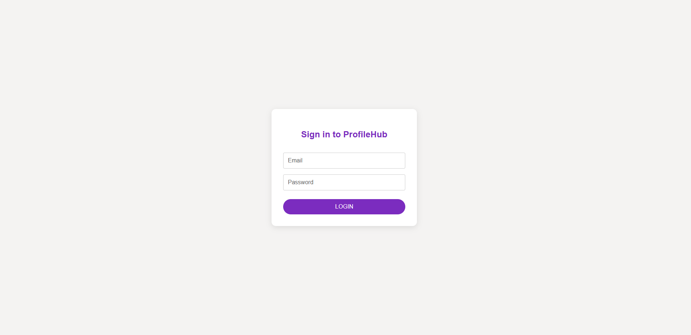
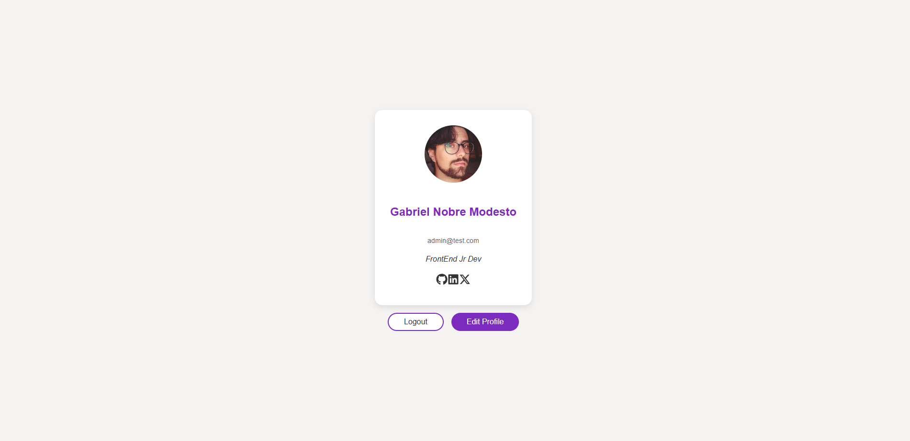

# ProfileHub

Social profile application developed with React, Vite and TypeScript.

This project was developed with a focus on learning and good practices for modern FrontEnd. Key technologies and concepts used include:

🌐React Router
Implementation of routes with React Router Dom that allow navigation between pages such as login and profile without reloading the page. Protection of routes based on the authentication status of the user.

🧠Context API
Using the Context API to manage the global authentication state. Allows accessing and updating user information from any component of the application in a centralized way.

🧩Status and forms
Management of local state with useState for forms and user interactions. Creation of a form for profile editing with controlled inputs and dynamic data updates.

💾Local Storage
Persistence of user data with localStorage to simulate a login session even after the page has been reloaded.

## 🚀 Display

[Application link](https://profilehubbr.netlify.app)

## 📸 Screenshots




## 🧰 Technologies Used

- [React](https://reactjs.org/)
- [Vite](https://vitejs.dev/)
- [TypeScript](https://www.typescriptlang.org/)
- [React Router](https://reactrouter.com/)
- [Context API](https://reactjs.org/docs/context.html)

## 📦 Installation & Running

```bash
git clone https://github.com/Gabzsk/ProfileHub.git
cd ProfileHub
npm install
npm run dev
```
